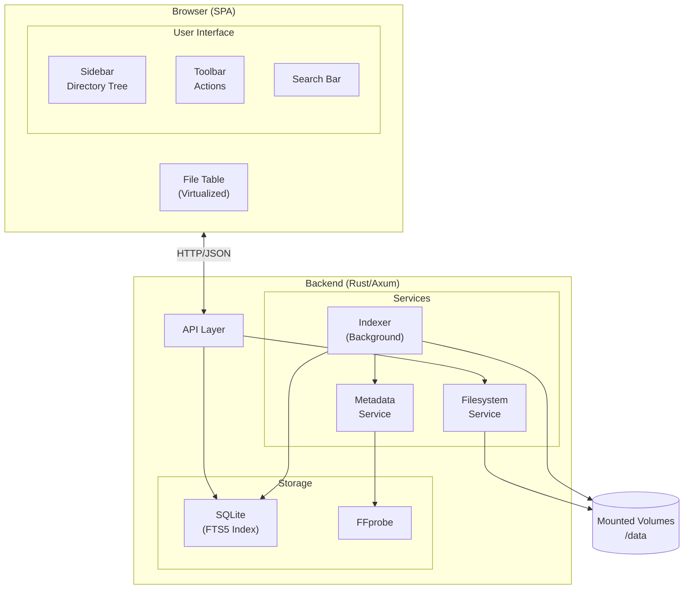
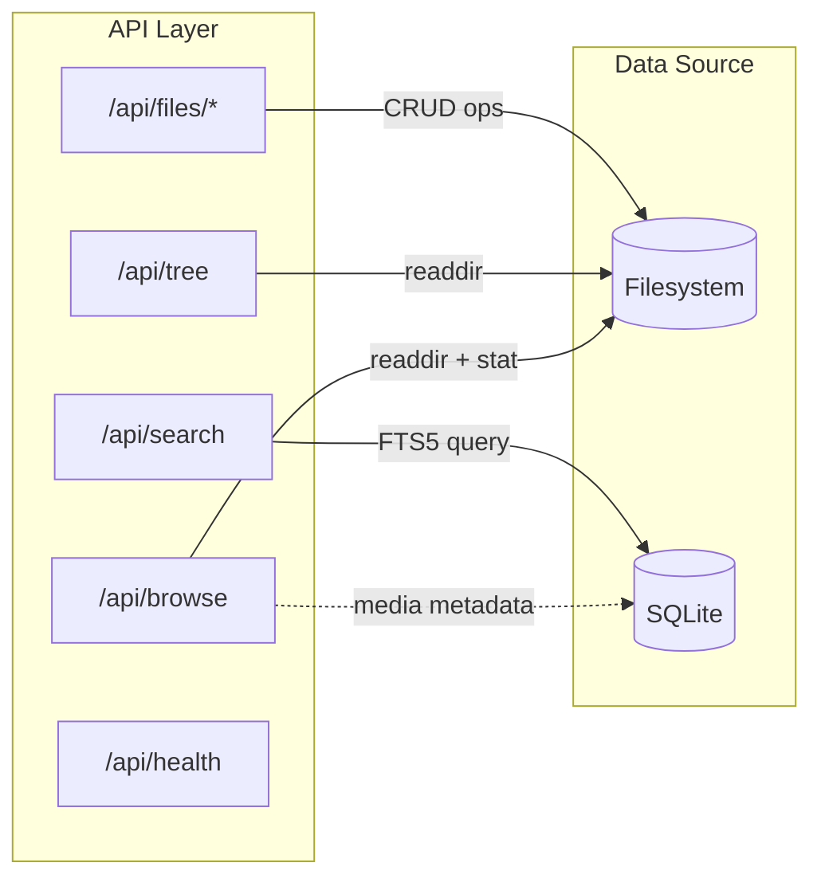

# CLAUDE.md

This file provides guidance to Claude Code (claude.ai/code) when working with code in this repository.

## Project Overview

Filex is a self-hosted web-based file manager with a desktop-like experience. It has a Rust/Axum backend and React/TypeScript frontend.

## Development Commands

### Backend (Rust)
```bash
cd backend
cargo build           # Build
cargo run             # Run server on http://localhost:3000
cargo test            # Run tests
```

### Frontend (React)
```bash
cd frontend
npm install           # Install dependencies
npm run dev           # Dev server on http://localhost:5173 (proxies API to :3000)
npm run build         # Production build (outputs to dist/)
npm run lint          # ESLint
```

### Docker
```bash
cd docker
docker-compose up --build   # Build and run on http://localhost:3000
```

## Project Structure

```
filex/
├── backend/                  # Rust backend
│   ├── src/
│   │   ├── main.rs          # Entry point, router setup
│   │   ├── config.rs        # Environment configuration
│   │   ├── api/             # HTTP handlers
│   │   │   ├── browse.rs    # Directory listing
│   │   │   ├── search.rs    # Search endpoint
│   │   │   ├── files.rs     # CRUD operations
│   │   │   ├── auth.rs      # Password authentication
│   │   │   └── system.rs    # Health, indexer status
│   │   ├── services/        # Business logic
│   │   │   ├── filesystem.rs # Path resolution, directory ops
│   │   │   ├── indexer.rs   # Background file walker
│   │   │   └── metadata.rs  # FFprobe wrapper
│   │   ├── db/              # Database layer
│   │   │   ├── schema.rs    # Table creation, FTS setup
│   │   │   └── queries.rs   # Search, upsert operations
│   │   └── models/          # Shared types
│   │       └── file.rs      # FileEntry, TreeNode, etc.
│   └── Cargo.toml
│
├── frontend/                 # React frontend
│   ├── src/
│   │   ├── main.tsx         # Entry point
│   │   ├── App.tsx          # Root component, providers
│   │   ├── api/
│   │   │   └── client.ts    # API client functions
│   │   ├── components/
│   │   │   ├── layout/      # Sidebar, MainPanel, SearchBar
│   │   │   ├── tree/        # DirectoryTree
│   │   │   ├── table/       # FileTable, columns
│   │   │   ├── auth/        # Login page
│   │   │   └── ui/          # Reusable primitives (Button, Input)
│   │   ├── hooks/           # useDirectory, useSearch
│   │   ├── stores/          # Zustand stores
│   │   ├── types/           # TypeScript interfaces
│   │   └── lib/             # Utilities
│   ├── index.html
│   ├── package.json
│   └── vite.config.ts
│
├── docker/
│   ├── Dockerfile           # Multi-stage build
│   └── docker-compose.yml   # Example deployment
│
├── TASKS.md                  # Implementation roadmap
└── README.md
```

## Architecture

### System Overview



### API Endpoints



### Backend (`backend/src/`)
- **main.rs** - Entry point, Axum router setup, static file serving
- **config.rs** - Environment configuration (FM_* variables)
- **api/** - HTTP handlers
  - `browse.rs` - Directory listing (`/api/browse`)
  - `search.rs` - FTS5 search (`/api/search`)
  - `files.rs` - CRUD operations (`/api/files/*`)
  - `auth.rs` - Password authentication
  - `system.rs` - Health, indexer status (`/api/health`)
- **services/** - Business logic
  - `filesystem.rs` - Path resolution, directory operations
  - `indexer.rs` - Background file walker for search index
  - `metadata.rs` - FFprobe wrapper for media metadata
- **db/** - SQLite with FTS5 for search

### Frontend (`frontend/src/`)
- **api/client.ts** - API client functions
- **components/**
  - `layout/` - Sidebar, MainPanel, Toolbar, SearchBar
  - `table/` - FileTable with TanStack Virtual
  - `tree/` - DirectoryTree
  - `auth/` - Login page
  - `ui/` - shadcn/ui primitives
- **stores/** - Zustand stores (selection, clipboard, UI state)
- **hooks/** - React Query hooks (useDirectory, useSearch, etc.)

### Key Design Patterns
- **Browsing**: Always reads from filesystem directly (real-time, authoritative)
- **Search**: Uses SQLite FTS5 index (background-indexed by `indexer.rs`)
- **State**: TanStack Query for server state, Zustand for UI state
- **Virtualization**: TanStack Virtual for large directory listings

## Configuration

Environment variables (prefix `FM_`):
- `FM_ROOT_PATH` - Root directory to serve (default: `/data`)
- `FM_PORT` - Server port (default: `3000`)
- `FM_DATABASE_PATH` - SQLite location (default: `/app/data/filex.db`)
- `FM_ENABLE_INDEXER` - Enable background indexing (default: `true`)
- `FM_INDEX_INTERVAL` - Indexer interval in seconds (default: `300`)
- `FM_AUTH_ENABLED` / `FM_AUTH_PASSWORD` - Optional password auth
- `PUID` / `PGID` - Docker user/group mapping

## Tech Stack
- Backend: Axum, Tokio, SQLite (sqlx), FFprobe
- Frontend: React 18, TanStack Query/Virtual, Zustand, Tailwind, shadcn/ui (Radix)
- Build: Cargo, Vite
